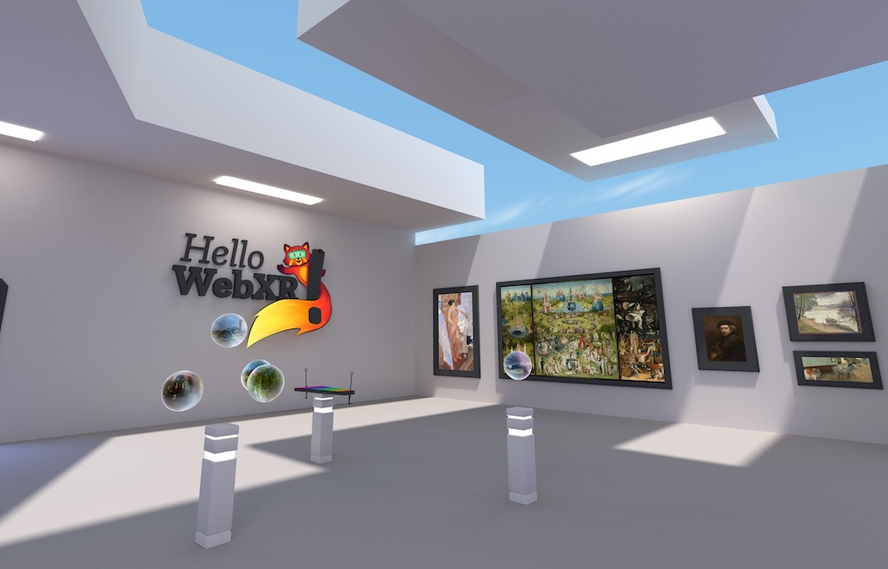

# PSE - Periodic Table VR Experience



An immersive WebXR educational visualization for exploring the Periodic Table of Elements in Virtual Reality with interactive chemistry experiments.

## Features

- 118 element rooms with 3D atomic models
- Interactive electron orbitals and atomic structure
- **6 interactive chemistry experiments** with simulation logic
- **8 themed room templates** for immersive element exploration
- **i18n support** (German and English)
- VR controller support with teleportation
- Atmospheric visual effects

### Interactive Experiments

| Experiment | Description | Elements |
|------------|-------------|----------|
| Reaction | Alkali metal water reactions | Li, Na, K |
| Electrical | Circuits, conductivity, magnetism | Cu, Ag, Au |
| Electrochemical | Batteries, electrolysis | Li, Zn |
| Nuclear | Fission, fusion, decay | U, Pu |
| Organic | DNA helix, proteins, polymers | C, N |
| Crystal | Lattice structures, crystal formation | Na, Cl, Fe |

### Themed Room Templates

| Theme | Visual Style | Elements |
|-------|-------------|----------|
| cosmic | Space/starfield atmosphere | H, He |
| energy | Battery/power station | Li |
| life | Organic/nature | C, N, O |
| forge | Metal/industrial | Fe |
| electric | Circuit/neon | Cu |
| treasure | Gold/vault | Au |
| nuclear | Reactor/glow | U |
| default | Standard PSE colors | Others |

## How to build

1. `npm install`
2. `npm start`
3. Open `http://localhost:8080`

## Controls

- **N key** - Next room
- **0-9 keys** - Jump to specific room
- **W/A/S/D** - Move camera (desktop)
- **E key** - Start experiment (desktop)
- **VR Controllers** - Teleport and interact

## Testing

```bash
npm test               # Playwright e2e tests
npm run test:unit      # Vitest unit tests (experiments)
npm run test:headed    # Run tests with browser UI
```

## Shader packing

If you make changes to the shaders you'll need to repack them:

`python packshaders.py [seconds]`

where `seconds` is an optional parameter (defaults to 5) to define how many seconds to wait until next rebuild.

## Extending Experiments

To add a new experiment type:

1. Create `src/experiments/YourExperiment.js` extending the state machine pattern
2. Add unit tests in `src/experiments/__tests__/YourExperiment.test.js`
3. Register experiment type in `src/data/elements.js` for relevant elements
4. Wire experiment to RayControl in `src/rooms/ElementRoom.js`

## Extending Themes

To add a new room theme:

1. Add theme config to `themeRegistry` in `src/lib/RoomThemeManager.js`
2. Map element themes via `themeAliases` if needed
3. Theme will auto-apply to elements with matching `theme` property

## Third party content

* Photogrammetry model by Geoffrey Marchal ([Sketchfab](https://sketchfab.com/3d-models/baptismal-angel-kneeling-f45f01c63e514d3bad846e82af640f33))
* 360 Panoramas from [Wikimedia Commons](https://commons.wikimedia.org/wiki/Main_Page)
* Classical Paintings from various public domain sources
* Public Domain sounds from [freesound.org](https://freesound.org)

## License

MIT License - See [LICENSE](LICENSE) for details.
